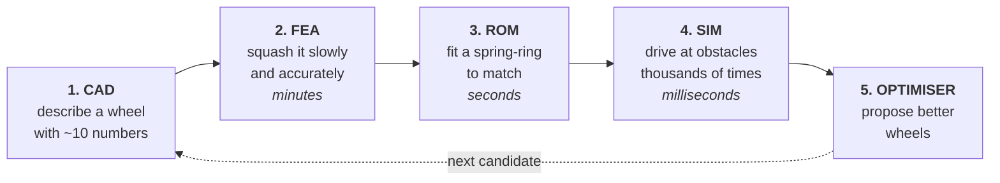

# Overview — the project in plain language

A one-sitting orientation. No prior knowledge assumed. Every acronym is spelled out the
first time and collected in the [glossary](#glossary) at the end.

The detailed plan lives in [`docs/plan/`](plan/00-index.md); this file is the map, not the
territory.

---

## 1. What we are building, in one paragraph

We are designing **squishy 3D-printed wheels** for a four-wheeled robot about the size of
a large toolbox — 400 × 300 × 200 mm, roughly 10 kg — that drives over doorsteps, kerbs
and rubble. Each wheel carries about 24.5 N and comes out around 170 mm across.
Instead of guessing a good wheel shape, we let a computer try thousands of shapes, simulate each one driving at obstacles, and pick
the best. The hard part is not the searching. The hard part is **simulating squishiness fast
enough to search at all**. Most of this project is the machinery that makes that possible.

## 2. The problem, and why it is hard

**Rigid wheels are easy to simulate and bad at obstacles.** A hard plastic wheel touches the
ground at essentially one point. Hitting a step, it either has enough torque and radius to
climb, or it stalls.

**Squishy wheels are good at obstacles and hard to simulate.** A soft wheel *wraps around* a
step edge. That does three useful things at once:

1. it grips more, because more rubber is touching the obstacle,
2. it effectively grabs the corner instead of pushing against it,
3. it absorbs shock, so the robot is not shaken apart.

The catch: soft wheels are also slower and less efficient on flat ground, because squishing
and un-squishing wastes energy. **So there is a real trade-off to optimise** — that is the
research question, not a foregone conclusion.

**Why simulating squishiness is hard.** Properly simulating a deforming rubber structure
means finite element analysis (FEA) — chopping the wheel into ~50,000 little chunks and
solving how each one pushes on its neighbours. That takes **minutes per wheel position**. To
optimise, we need to simulate a robot *driving* — thousands of positions per run, thousands
of runs. Doing it directly would be roughly **1,000 to 100,000 times too slow**.

> The naive fix — telling the physics engine "make the contact a bit soft" — does not work.
> That is a numerical smoothing knob, not a model of rubber. It cannot reproduce the contact
> patch growing under load, the wheel wrapping a corner, or energy loss. Mistaking one for
> the other is the single easiest way to get a confident, wrong answer, so the project bans
> it outright (see [invariant 8](#7-the-rules-we-do-not-break)).

## 3. The core idea

Borrowed from the car-tyre industry, which solved this decades ago:

> **Measure the squishiness carefully once. Boil it down to a handful of numbers. Then
> simulate a cheap fake wheel that behaves the same way.**

Concretely, we replace the soft wheel with a **ring of 24–48 rigid blocks connected by
springs**. It is not made of rubber, and it does not deform like rubber internally — but
under load it *pushes back* like the real wheel does, because we tuned the springs to match
the slow accurate simulation. That fake wheel runs fast enough to drive around.

The technical name for "cheap stand-in tuned to match an expensive model" is a
**reduced-order model (ROM)**. It is the heart of the project.



**The key structural rule: step 2 never runs inside the loop.** FEA happens once per design,
offline, and the result is cached. The loop only ever runs the cheap version. Later, we skip
even that — after a few hundred designs we train a predictor that guesses the spring values
straight from the shape, so most designs skip FEA entirely.

## 4. The pipeline, stage by stage

| # | Stage | Input | Output | Software | Speed |
|---|---|---|---|---|---|
| 1 | **CAD** — build the shape | ~10 numbers (radius, spoke count, thickness…) | 3-D solid + weight | **build123d** — the Python library we write shapes in. **OCCT** (via **OCP**) — the geometry kernel underneath it, which does the actual solid modelling and writes the STEP file. **NumPy** — spoke maths, screening and weight, all of which run *without* the kernel. **matplotlib** — optional, draws the PDF report | seconds |
| 2 | **FEA** — measure stiffness | the 3-D solid, or a slice through it | how hard it pushes back | **gmsh** — chops the wheel into ~50,000 tetrahedra, or the flat cross-section into ~2,600 triangles. **CalculiX** (`ccx` 2.23) — the solver; a standalone program we launch and exchange text files with, not a Python library. **NumPy** — reads the solver's output back and extracts the curve | ~20 s for a slice, ~20 h for the full solid |
| 3 | **ROM** — fit the stand-in | the stiffness curve | spring settings | **NumPy** / **SciPy** — the curve fitting itself. **MuJoCo** — the ring model is built and exercised here to check the fit is real. Later, **BoTorch** / **GPyTorch** — a predictor that guesses spring settings straight from the shape, skipping FEA entirely | seconds |
| 4 | **SIM** — drive it | the spring-ring wheel | did it climb? how fast? how much energy? | **MuJoCo** — the fast physics engine that runs the scenarios. **CoACD** + **trimesh** — cut the shape into simple convex pieces the engine can collide quickly. **PyChrono** — a slower, much more accurate independent simulator, used only to check the cheap model, never inside the loop | milliseconds |
| 5 | **OPTIMISER** — choose next | all scores so far | the next shapes to try | **Ax** / **BoTorch** — the Bayesian optimiser. **CMA-ES** or **NSGA-II** — final local polish, which evolution strategies do better than Bayesian methods. **Hydra** — configuration, so no number is buried in code. **DuckDB** + **Parquet** — stores every run, one row per design × scenario × seed | seconds |

Installed and running today: everything in stages 1 and 2, plus NumPy throughout. The rest is
the intended stack, chosen in the decision records (§8) but not yet built — see the road map
in §6. All of it is free and open-source, and all of it runs on one laptop.

Two practical notes. **CalculiX and PyChrono are not normal Python packages**: `ccx` is a
compiled program that we run as a separate process, and PyChrono has no PyPI release at all.
That is the entire reason the project uses a conda environment rather than a plain
`virtualenv`. And **the heavy pieces are optional** — a machine that only screens designs for
printability needs NumPy and nothing else, which is why the install is split into
`[cad]`, `[fea]` and `[viz]` extras.

### Stage 1 — CAD (Computer-Aided Design)

A program writes the wheel, rather than a human drawing it. Give it a handful of numbers —
outer radius, width, number of spokes, spoke thickness, how curved the spokes are — and it
produces a real 3-D solid.

It also **screens the design first**, in milliseconds: are the spokes so close together the
printer nozzle cannot fit between them? Is it too big for the robot? A bad design is rejected
before any expensive work happens.

*Status: done and verified.*

### Stage 2 — FEA (Finite Element Analysis)

Take the solid, chop it into ~50,000 tetrahedra, and press it against an obstacle in small
steps, solving the whole structure each time. We do this twice:

- **against a flat plate** — the reference measurement,
- **against a step edge** — the case that actually decides obstacle climbing, and the one the
  published tyre literature tends to skip.

Out comes the **stiffness curve** `k_r(δ)`: how much force it takes to squash the wheel by a
given amount. Plus the contact patch size, how much the wheel's effective radius shrinks
under load, and whether the spokes buckle.

*Status: done and verified — 20/20 checks pass.*

### Stage 3 — ROM (Reduced-Order Model)

Fit the ring-of-blocks-and-springs so its force-versus-squash curve matches what FEA
measured. Then check honestly how close the match is, and report the error.

*Status: next up.*

### Stage 4 — SIM (dynamic simulation)

Drive the robot at obstacles in MuJoCo, a fast physics engine. Eight scenarios (S1–S8):
steps, slopes, gaps, rubble, a flat sprint, path following, washboard ripples, sustained
load. Each design is scored on obstacle capability, energy use, speed and ride quality.

Every design is run many times over **different random terrains and different plausible
rubber properties**, because we do not precisely know the material — and a design that only
works for one exact rubber recipe is useless in practice.

*Status: not started.*

### Stage 5 — OPTIMISER

Propose the next batch of shapes to try, using Bayesian optimisation — a method that builds a
running guess of "which regions of the design space look promising" and samples there.

Crucially it keeps the objectives **separate** rather than mashing them into one score. There
is no single best wheel; there is a *set* of best trade-offs (a **Pareto front**) — this one
climbs better, that one is more efficient. Collapsing that into one number destroys the
actual result.

*Status: not started.*

## 5. Where the project is right now

Roughly **week 1 of a 60-week plan**, and deliberately so: the first week is a
[feasibility spike](plan/16-first-week.md) that tests the riskiest assumption before building
infrastructure that depends on it.

| Step | What | Status |
|---|---|---|
| 1 | Freeze the robot specification | sized to the real 400 × 300 × 200 mm platform, still not frozen |
| 2 | CAD: shape → 3-D solid | **done**, 48/48 checks |
| 3 | FEA: solid → stiffness curve | **done**, 20/20 checks (re-running at the new load) |
| 4 | ROM: fit the spring-ring | **next** |
| 5 | Drive it at a step edge vs a rigid wheel | not started |
| 6 | Look hard at the result, decide whether to continue | not started |

**What we already know works.** A test wheel (60 mm radius, 6 spokes, TPU) pressed into an
obstacle behaves correctly: it gets stiffer the more you squash it, its contact patch
grows, its effective radius shrinks, and — the important one — **against a step edge the
contact is smaller and the pressure higher than against a flat plate**. That is the
envelopment signature. It is the mechanism that lets a soft wheel climb, and it showed up in
the numbers without being put there.

**The big open question**, and the reason for the spike: does the cheap spring-ring model
actually reproduce the real behaviour well enough to optimise against? If not, the plan is to
fall back to a simpler wheel family (soft tread on a rigid hub) and narrow the claims. Better
to learn that in week 14 than week 30.

## 6. The road map

| Phase | Weeks | What happens | Gate to pass |
|---|---|---|---|
| **0 Foundations** | 1–4 | Robot spec, repo, rigid wheel rolling end-to-end | Same design → same score, two machines, two days apart |
| **1 FEA + ROM** | 5–14 | The critical path. Build and validate the stand-in model | ROM within 10% of FEA stiffness; ranking agreement ρ > 0.8 |
| **2 Optimiser** | 15–24 | Full scenario suite, ≥ 300 designs/day, train the shape → springs predictor | Beats random search, with confidence intervals |
| **3 Main campaign** | 25–36 | 2,500–3,500 designs across all wheel families; validity audits | Cross-engine agreement ρ > 0.7 |
| **4 Hardware** | 37–50 | Print 8 wheels, build a test rig, measure reality | Sim-to-real correlation reported honestly, whatever it is |
| **5 Write-up** | 51–60 | Release the benchmark; papers | — |

A **gate** is a go/no-go checkpoint. Failing one means stopping and rethinking, not pressing
on. Phase 1's gate is the one that matters most: *if the cheap model cannot reproduce the
expensive one, the whole approach needs rethinking.*

## 7. The rules we do not break

These are in [`CLAUDE.md`](../CLAUDE.md) as "invariants". In plain terms:

1. **Never run the slow, accurate simulation inside the search loop.** It is offline and
   cached, always.
2. **Always compute weight and stiffness from the actual shape and material.** Never hard-code
   them, never hold them fixed between designs. A wheel whose stiffness silently never changes
   would produce beautiful, meaningless results.
3. **Rejecting a bad design must be cheap** — milliseconds, not a six-minute simulation.
4. **Nothing crashes the campaign.** A failed simulation returns "this failed, here is why",
   never an error that stops everything. Running thousands of nonlinear simulations
   unattended, some *will* fail; that is normal, and it gets logged as a health metric.
5. **Change the method, invalidate the old results.** Every cached result is tagged with the
   version of the code that produced it, so nothing stale is ever silently reused.
6. **Keep the objectives separate.** No single blended score.
7. **Score every design across many random terrains and material guesses**, and judge it by
   its *bad* days, not its average day (a measure called CVaR). Robustness is a requirement,
   not a refinement.
8. **The physics engine's "soft contact" setting is not squishiness.** Never use it as a
   stand-in for rubber.

## 8. Key decisions, and why

Recorded as ADRs — Architecture Decision Records, one file per decision, in
[`docs/decisions/`](decisions/README.md). Each records what was chosen, what was rejected,
and *why*, so nobody re-litigates it from memory.

| # | Decision | Short reason |
|---|---|---|
| 0001 | MuJoCo for the fast inner loop | Fast and reliable. NVIDIA's soft-body engine was rejected because it has no static friction — meaning no correct grip, which breaks the whole point |
| 0002 | Stand-in model instead of real FEM in the loop | Real FEM is 1,000–100,000× too slow |
| 0003 | build123d for CAD, exporting STEP | FEA needs true curved surfaces, not a triangle mesh |
| 0004 | Chrono as "ground truth" | An independent, much more accurate simulator to check our cheap model against — never used in the loop |
| 0005 | CalculiX for the FEA | Free, scriptable, batch-friendly, boring in the good way |
| 0006 | Keep objectives separate (Pareto) | Blending them into one number destroys the actual finding |
| 0007 | CoACD for collision shapes | Better shape approximation than the older standard |

## 9. Two honest limitations

Stated up front, because they shape what the project can claim:

- **We do not have lab equipment to measure the rubber properly.** We use published values
  and cheap DIY tests. So we cannot make precise absolute predictions — we can rank designs.
  The project turns this into a research question: *how much does not knowing the material
  cost you, and can you optimise in a way that is robust to not knowing?*
- **Energy loss in the rubber is not modelled from first principles.** The material model we
  can afford is "springy but lossless", so the FEA cannot produce a hysteresis (energy-loss)
  number. That is a real gap, and it is written down rather than filled with a plausible
  guess.

## 10. Running things

Everything assumes the project environment is active: `conda activate conda3.12`.

```bash
# Fast checks — no heavy dependencies, about a second.
python -m unittest discover -s tests -t .

# Is this design even buildable? Milliseconds, no CAD kernel.
python scripts/gen_wheel.py --screen-only --spokes 20 --thickness 2.4

# Build a wheel: 3-D file + weight + a PDF drawing.
python scripts/gen_wheel.py --radius 70 --spokes 16 --plot-pdf

# FEA without the solver — builds the mesh and input file only.
python scripts/run_fea.py --dry-run --tiny --case flat --case step_edge

# The real thing: squash the wheel, plot the results.
python scripts/run_fea.py --tiny --case flat --case step_edge --plot-pdf

# Full verification batteries.
python scripts/verify_cad.py
python scripts/verify_fea.py --full
```

---

## Glossary

### The essentials

| Term | Meaning |
|---|---|
| **Compliant** | Squishy. Deforms usefully under load. The opposite of rigid |
| **TPU** | Thermoplastic Polyurethane — flexible 3-D printing filament. The rubber-like stuff |
| **FDM** | Fused Deposition Modelling — ordinary filament 3-D printing |
| **FEA / FEM** | Finite Element Analysis / Method — chop an object into small chunks and solve how it deforms. Accurate, slow |
| **ROM** | Reduced-Order Model — a cheap stand-in tuned to behave like an expensive model |
| **Contact patch** | The area actually touching the ground. Bigger = more grip |
| **Envelopment** | A soft wheel wrapping around an obstacle instead of bumping into it |
| **Buckling** | A slender part suddenly collapsing sideways instead of squashing evenly |
| **Hysteresis** | Energy lost as heat when a material is squashed and released |
| **Pareto front** | The set of best trade-offs, when no single design wins at everything |
| **CVaR** | Conditional Value at Risk — the average of the *worst* outcomes. Judging a design by its bad days |

### File formats and tools

| Term | Meaning |
|---|---|
| **CAD** | Computer-Aided Design |
| **STEP** | Exact 3-D format with true curved surfaces. Our source of truth |
| **STL** | Triangle-mesh 3-D format. Approximate, derived, never authoritative |
| **BREP** | Boundary Representation — how STEP describes shapes exactly |
| **OCCT / OCP** | Open CASCADE Technology — the geometry engine underneath build123d |
| **build123d** | The Python library we write CAD in |
| **gmsh** | Chops a solid into elements for FEA |
| **CalculiX (`ccx`)** | The FEA solver. A standalone program we call and read files from |
| **MuJoCo** | The fast physics engine for the inner loop |
| **Chrono / PyChrono** | A much slower, much more accurate simulator, used as a reference |
| **NumPy / SciPy** | The standard Python numerical libraries. Arrays, and curve fitting |
| **matplotlib** | Draws the PDF reports |
| **CoACD / trimesh** | Cut a shape into simple convex pieces so collisions are fast to compute |
| **Ax / BoTorch / GPyTorch** | Meta's Bayesian-optimisation stack. Ax runs the experiment, BoTorch and GPyTorch do the maths underneath |
| **CMA-ES / NSGA-II** | Evolutionary search methods. Better than Bayesian optimisation at the final polish, worse at the broad hunt |
| **Hydra** | Configuration system, so settings live in files rather than buried in code |
| **DuckDB / Parquet** | A database and a file format for storing results. Fast for "give me every run where…" questions |
| **conda / conda-forge** | Package manager and its community repository. Used here because two of our tools are not installable any other way |
| **ADR** | Architecture Decision Record |

### Things you will see in the code

| Term | Meaning |
|---|---|
| **`k_r(δ)`** | Radial stiffness — how much force to squash the wheel by distance δ. The main FEA output |
| **Load case** | One specific test: "press against a flat plate", "press against a step edge" |
| **Mooney-Rivlin** | A mathematical description of how rubber stiffens as you stretch it |
| **C3D10** | A curved 10-cornered tetrahedral element — the chunk shape our FEA uses |
| **DOF** | Degrees of Freedom — how many unknowns the solver handles. ~50,000 here |
| **Jacobian** | A measure of whether an element is a sane shape or folded inside-out |
| **`T0`…`T6`** | Wheel families: `T0` rigid cylinder (baseline), **`T3` compliant spoke (our main target)**, `T4` all-TPU, `T5` spokes + lugs, `T6` soft tread on rigid hub (fallback) |
| **`S1`…`S8`** | Test scenarios: step, slope, gap, rubble, flat sprint, path tracking, washboard, sustained load |
| **`RQ1`…`RQ4`** | The four research questions — design trade-offs, method, validity, robustness |
| **Invariant** | A rule that must never be broken, listed in `CLAUDE.md` |
| **Gate** | A go/no-go checkpoint at the end of a phase |
| **NPT** | Non-Pneumatic Tire — airless tyres. The closest existing literature |
| **Spearman ρ** | A 0–1 score for "do two rankings agree?" Used to check simulation against reality |
